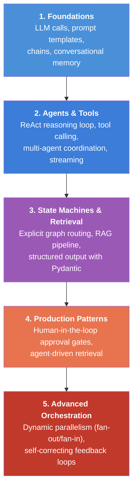
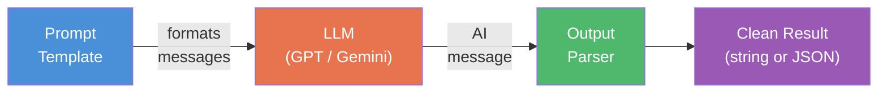
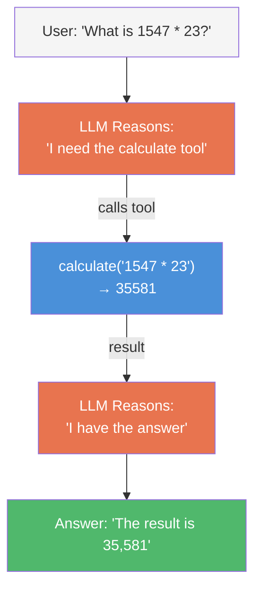
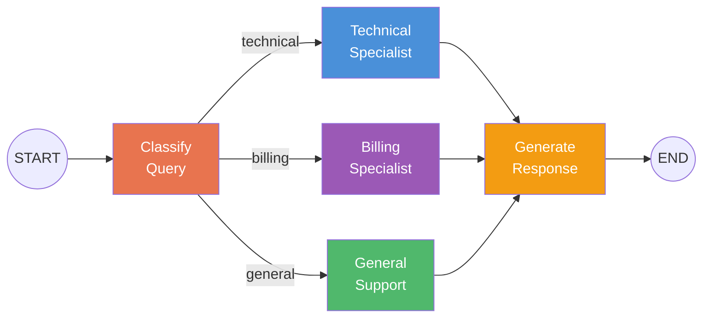
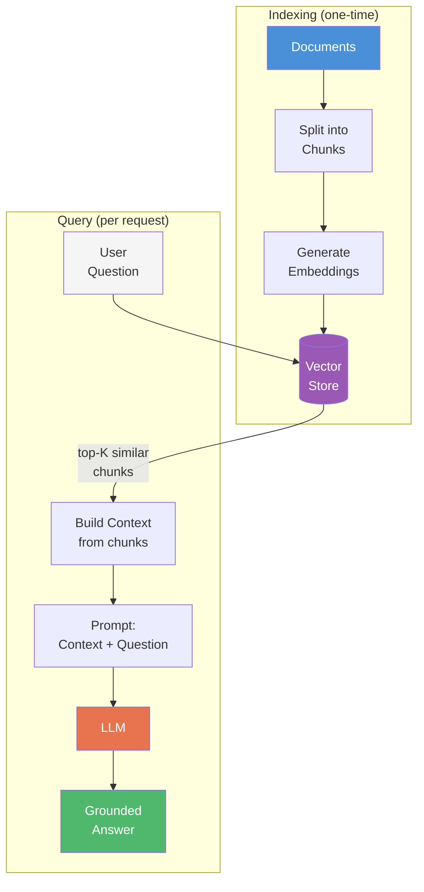
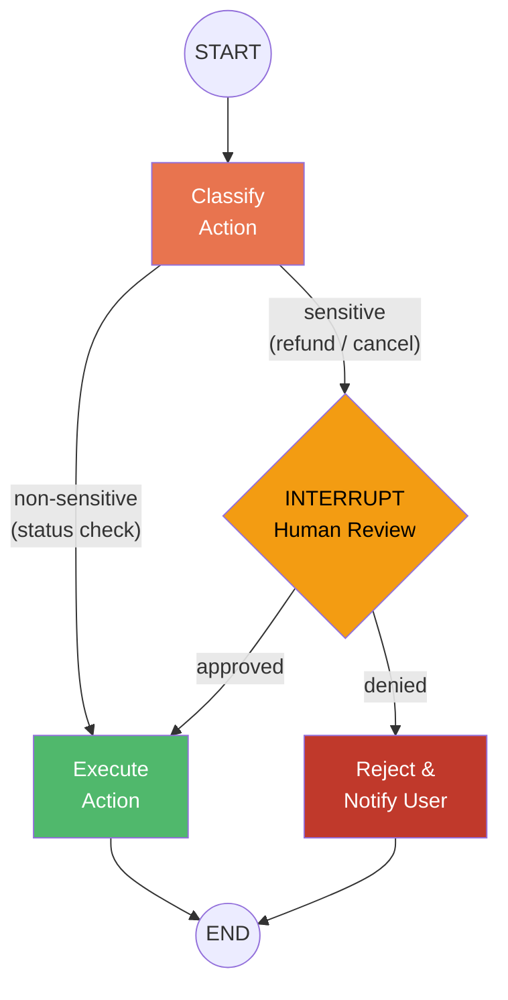
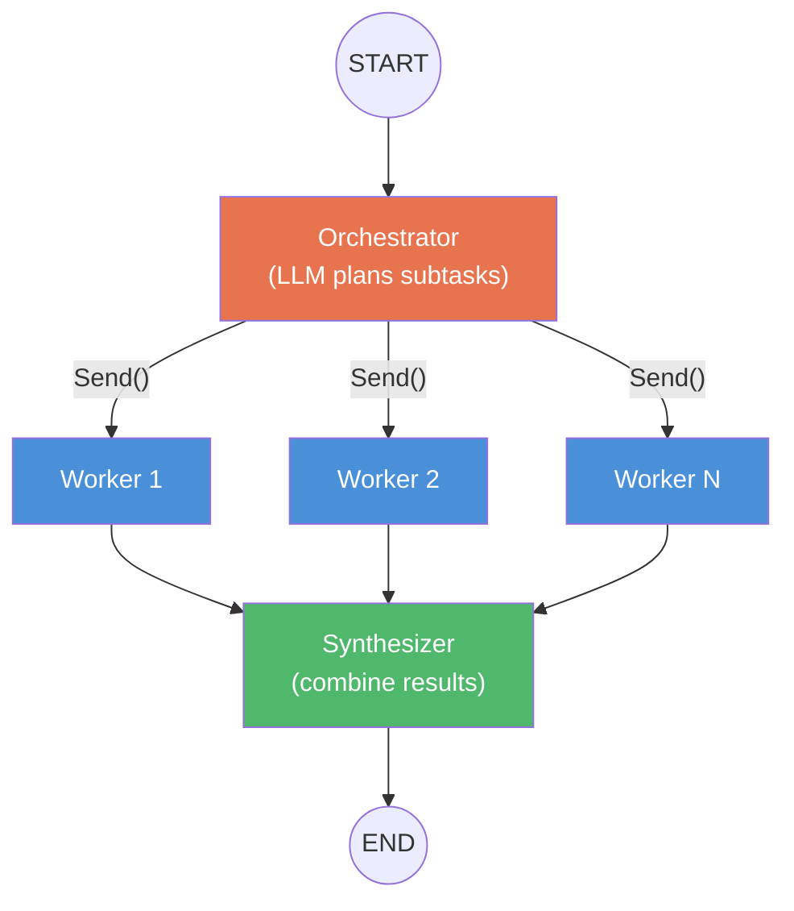
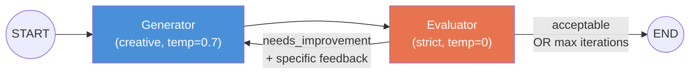
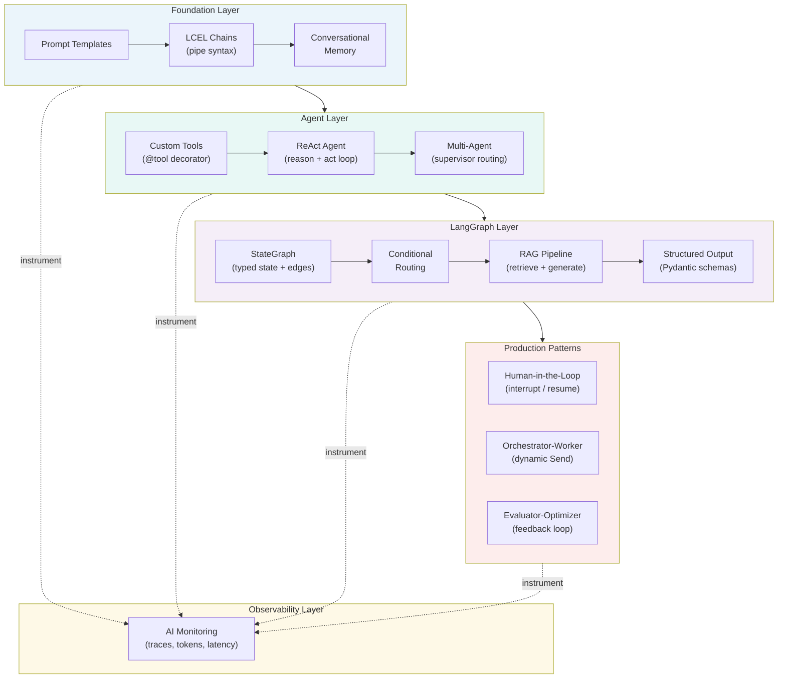
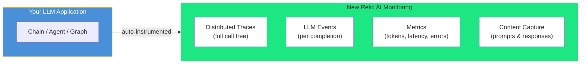

# Building LLM Applications with LangChain & LangGraph: What I Learned

**Author:** Ashish Singh

---

## Why I Explored This

LLM-powered applications are quickly becoming the next major category of software. Frameworks like **LangChain** and **LangGraph** are what developers reach for to build them — from simple chatbots to complex multi-agent orchestration systems. I wanted to understand these patterns deeply, hands-on, to see how modern AI applications actually work under the hood.

This blog captures the core concepts I learned, the architecture patterns that matter, and how observability transforms debugging LLM apps from guesswork into science.

---

## The Journey: From a Single LLM Call to Full Orchestration

Building LLM apps is a progressive skill. Each concept builds on the last:



Let me walk through the most important things I learned at each level.

---

## Core Concept 1: Everything is a Composable Pipe

The single most important idea in LangChain is **LCEL (LangChain Expression Language)**. Every component — prompts, LLMs, parsers — snaps together using the pipe (`|`) operator:

```python
from langchain_core.prompts import ChatPromptTemplate
from langchain_core.output_parsers import StrOutputParser

prompt = ChatPromptTemplate.from_messages([
    ("system", "You are a concise assistant."),
    ("human", "Explain {concept} in simple terms."),
])

# This is a "chain" — data flows left to right
chain = prompt | llm | StrOutputParser()
result = chain.invoke({"concept": "vector embeddings"})
```



**What I learned:** This pipe syntax isn't just syntactic sugar — it creates a `RunnableSequence` that can be streamed, batched, retried, and traced as a single unit. You can even chain two LLM calls sequentially where the output of one feeds the input of another.

---

## Core Concept 2: Agents — When the LLM Controls the Flow

A chain is a **fixed pipeline** — you define the steps. An agent is **dynamic** — the LLM decides which tools to call and in what order using a reasoning loop:

```python
from langchain_core.tools import tool

@tool
def calculate(expression: str) -> str:
    """Evaluate a math expression. Use for any arithmetic."""
    return str(eval(expression))

@tool
def get_current_time() -> str:
    """Return the current date and time."""
    return datetime.now().strftime("%Y-%m-%d %H:%M:%S")

# The agent sees the tool docstrings and decides when to use them
agent = create_agent(llm, tools=[calculate, get_current_time])
```



**What I learned:** The `@tool` decorator's **docstring is critical** — the LLM reads it to decide when to use the tool. A vague docstring means the agent picks the wrong tool. Also, agents can chain multiple tools in sequence — asking "analyze this text then multiply the word count by 100" triggers two tool calls automatically.

---

## Core Concept 3: StateGraph — Explicit Control Over the Flow

LangGraph lets you build **state machines** where you define exactly how data flows. Each node is a function that reads and updates typed state, and edges define routing:

```python
class SupportState(TypedDict):
    query: str        # User's question
    category: str     # Classified: technical, billing, general
    context: str      # Specialist knowledge
    response: str     # Final answer

graph = StateGraph(SupportState)
graph.add_node("classify", classify_node)
graph.add_node("technical", technical_node)
graph.add_node("billing", billing_node)
graph.add_conditional_edges("classify", route_by_category)
```



**What I learned:** The difference between `create_agent()` and `StateGraph` is like the difference between an ORM and raw SQL. `create_agent()` hides the graph behind a convenience wrapper. `StateGraph` gives you full control — and production apps need that control for conditional routing, error handling, and custom state management.

---

## Core Concept 4: RAG — Grounding LLMs in Real Data

**RAG (Retrieval Augmented Generation)** is the most common production LLM pattern. Instead of relying on the model's training data, you feed it relevant documents at query time:



```python
# Split documents into chunks
splitter = RecursiveCharacterTextSplitter(chunk_size=300, chunk_overlap=50)
chunks = splitter.create_documents(documents)

# Create vector store with embeddings
vector_store = InMemoryVectorStore.from_documents(chunks, embeddings)
retriever = vector_store.as_retriever(search_kwargs={"k": 3})

# Query: retrieve relevant chunks, then generate answer
docs = retriever.invoke("What is RAG?")
context = "\n".join(doc.page_content for doc in docs)
answer = (rag_prompt | llm | StrOutputParser()).invoke({
    "context": context, "question": "What is RAG?"
})
```

**What I learned:** RAG has three critical tuning knobs — **chunk size** (too large = noise, too small = lost context), **overlap** (maintains continuity between chunks), and **K** (number of retrieved chunks). Getting these wrong makes the LLM either hallucinate or miss relevant information.

---

## Core Concept 5: Production Patterns That Change Everything

### Human-in-the-Loop: Pause, Ask, Resume

Production agents must NOT take irreversible actions (refunds, deletions, sends) without a human check. LangGraph's `interrupt()` pauses the graph mid-execution and waits for human input:

```python
from langgraph.types import interrupt, Command

def human_review_node(state):
    # This PAUSES the entire graph and sends context to the user
    decision = interrupt({
        "message": f"Agent wants to process a {state['action']}. Approve?",
        "action": state["action"],
    })
    # Execution resumes here when human responds
    return {"approved": decision.get("approved", False)}

# Resume later with: Command(resume={"approved": True})
```



**What I learned:** `interrupt()` requires a **checkpointer** — the graph serializes its entire state to storage, pauses, and can resume hours later from that exact checkpoint. Each conversation needs a unique `thread_id`. This is how LangGraph achieves pause/resume without polling or external queues.

### Orchestrator-Worker: Dynamic Parallelism

The most powerful pattern I encountered. An LLM **plans** subtasks at runtime, spawns **parallel workers** via `Send()`, and a synthesizer combines results. The number of workers isn't hardcoded — the LLM decides:

```python
from langgraph.types import Send

def assign_workers(state):
    """LLM planned 3 sections? Spawn 3 workers. Planned 5? Spawn 5."""
    return [
        Send("worker", {"title": s.title, "description": s.description})
        for s in state["sections"]
    ]
```



**What I learned:** Each worker gets **isolated state** — only the data passed via `Send()`, not the full graph state. Results aggregate back using **reducers** (`Annotated[list, operator.add]`). This is how you build report generators, multi-file code editors, and research assistants that scale dynamically.

### Evaluator-Optimizer: Self-Correcting Loops

Single-pass LLM output is unreliable. The fix: one LLM generates, another evaluates. If rejected, feedback loops back for revision:

```python
class Evaluation(BaseModel):
    grade: Literal["acceptable", "needs_improvement"]
    feedback: str  # Specific, actionable feedback

MAX_ITERATIONS = 3  # Safety guard against infinite loops
```



**What I learned:** Two key design choices: (1) use **different temperatures** — creative (0.7) for the generator, deterministic (0) for the evaluator, and (2) always have a **MAX_ITERATIONS guard** — without it, a picky evaluator creates an infinite loop. The evaluator uses `with_structured_output()` to return a typed grade, not free-form text.

---

## Full Architecture: How It All Connects



---

## Why Observability Matters for LLM Applications

LLM applications are fundamentally different from traditional software. Here's what makes them hard to debug without observability:

| Challenge | Why It's Hard | What Observability Reveals |
|-----------|---------------|---------------------------|
| **Non-deterministic output** | Same input, different output every time | Track output variance across runs, identify temperature/prompt issues |
| **Hidden costs** | Token usage isn't visible in code | Per-request token counts, cost attribution, model comparison |
| **Unpredictable latency** | RAG retrieval + LLM generation = variable response times | Breakdown: embedding time vs. retrieval vs. generation |
| **Chain/agent complexity** | A single user request may trigger 2–10 LLM calls | Full distributed trace showing every LLM call, tool invocation, and routing decision |
| **Feedback loops** | Evaluator-optimizer may iterate 1–3 times | Iteration count per request, convergence tracking |
| **Dynamic parallelism** | Orchestrator spawns unknown number of workers | Fan-out visibility, per-worker latency, aggregation timing |

**The key learning:** Without observability, debugging an LLM app that "sometimes gives bad answers" is like debugging a distributed system with `print` statements. You need traces, metrics, and event correlation.

---

## Integrating with New Relic: Seeing Inside LLM Apps

New Relic's AI Monitoring automatically instruments LangChain and LangGraph applications. Here's what the integration looks like in practice:

### Setup

```python
# newrelic.ini
[newrelic]
ai_monitoring.enabled = true
ai_monitoring.streaming.enabled = true
ai_monitoring.record_content.enabled = true
```

```bash
# Run any LLM application with full instrumentation
NEW_RELIC_CONFIG_FILE=newrelic.ini newrelic-admin run-program python my_app.py
```

That's it. No code changes needed.

### What You See



**For each LLM call, New Relic captures:**

- **LlmChatCompletionSummary** — model, temperature, token counts (prompt + completion), duration, finish reason
- **LlmChatCompletionMessage** — one event per message (system prompt, user input, assistant response)
- **Distributed trace spans** — showing the full call tree: chain → retrieval → embedding → LLM → parser

### What I Learned by Observing My Own Apps

1. **RAG is expensive** — a single RAG query triggers an embedding call + vector search + LLM generation. The embedding call is often 30-40% of total latency
2. **Agents are unpredictable** — a ReAct agent might call 1 tool or 5 tools for the same type of question. Traces reveal the reasoning path
3. **Feedback loops multiply costs** — an evaluator-optimizer that iterates 3 times uses 6x the tokens of a single-pass call. Observability shows which prompts consistently need multiple iterations
4. **Streaming changes the trace shape** — streaming responses appear as a single span that stays open until the last token. The agent wraps the iterator and records the aggregated result on stream completion

### Querying LLM Data in NRQL

```sql
-- Token usage by model
SELECT average(request.model), sum(token_count)
FROM LlmChatCompletionSummary
FACET request.model SINCE 1 hour ago

-- Slowest LLM calls
SELECT average(duration)
FROM LlmChatCompletionSummary
FACET name SINCE 1 hour ago

-- Error rate by chain type
SELECT percentage(count(*), WHERE error IS true)
FROM LlmChatCompletionSummary
FACET request.model SINCE 1 day ago
```

---

## Key Takeaways

1. **LCEL pipes are the atom of LangChain** — every application, no matter how complex, is built from `prompt | llm | parser` chains composed together

2. **StateGraph is what production uses** — explicit state machines with typed state, conditional edges, and clear routing beat hidden agent abstractions for anything beyond prototyping

3. **Three patterns define advanced LLM apps** — human-in-the-loop (`interrupt`/`resume`), dynamic parallelism (`Send`), and self-correcting loops (graph cycles). Master these and you can build anything

4. **Observability isn't optional** — LLM apps are non-deterministic, expensive, and opaque. Traces and token metrics are the only way to understand what's actually happening

5. **Provider-agnostic by design** — switching from OpenAI to Google Gemini changes the LLM initialization, not the application logic. The framework abstractions (chains, graphs, tools) work identically across providers

